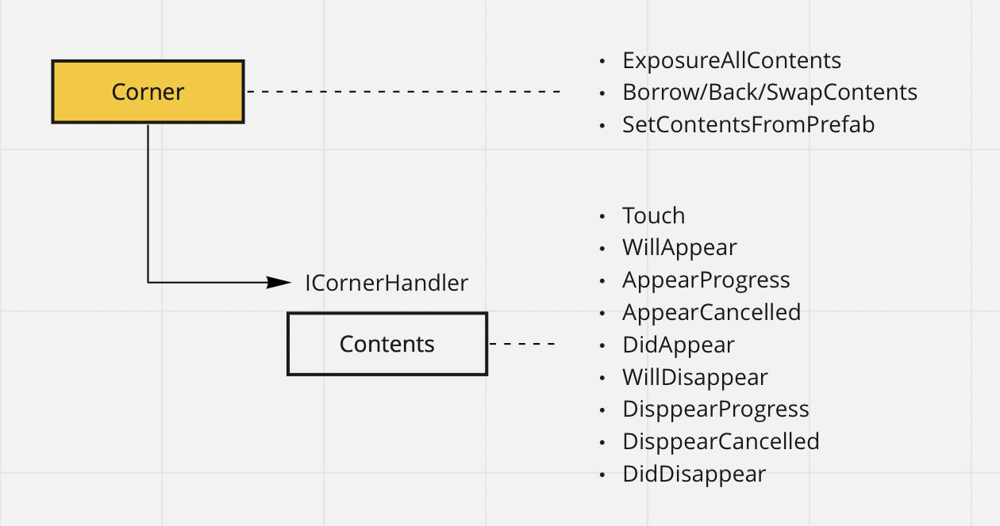

# GamenChanger
the UI Component implementation & UI interaction tuning tool for Unity.  
Synchronize the UI running on the UnityEditor and the actual device without build.

*this product is in early stage of its implementation. do not use in production yet.

## 1. Corner
"Corner" is the component which can retrieve every Unity component which extends UIComponent.

the Corner component automatically captures all child UI components and
then you can
* swap all contents to another Corner's all contents.
* borrow all contents from other Corner's all contents. other become empty.
* back all contents to it's owner. become empty.

* exposure contents with Type.
* exclude specific contents.

ICornerContentHandler interface receives the events of Corner.
this is convenient for control contents itself when the Corner is changed by other Corner functions.

## 2. FlickableCorner, OneOfNCorner, DraggableCorner and OverlayCorner(WIP)

### 2-1. FlickableCorer
FlickableCorner can have 4 additional Corners on the Top/Bottom/Left/Right of it. 
when player touches FlickableCorner which has one or more Corners, FlickableCorner can be flicked to the direction of connected Corners.

IFlickableCorner interface receives "Flick" events from FlickableCorner.

### 2-2. OneOfNCorner
OneOfNCorner can have N contents and is able to choice the 1 from there.
when you tap the UI which is contained in OneOfNCorner, you can update the status of choosed 1 object and others.

IOneOfNCorner interface receives "choose" events from OneOfN.

### 2-3. DraggableCorner
DraggableCorner can have 1 or more contents and enable it to draggable and limit it's move to inside of the size of the DraggableCorner attached object.

### 2-4. OverlayCorner(WIP)
OverlayCorner can have one additional Corner and set it to back of this OverlayCorner when active.

## furure(WIP)
 

 

## license
see below.  
[LICENSE](./LICENSE)
